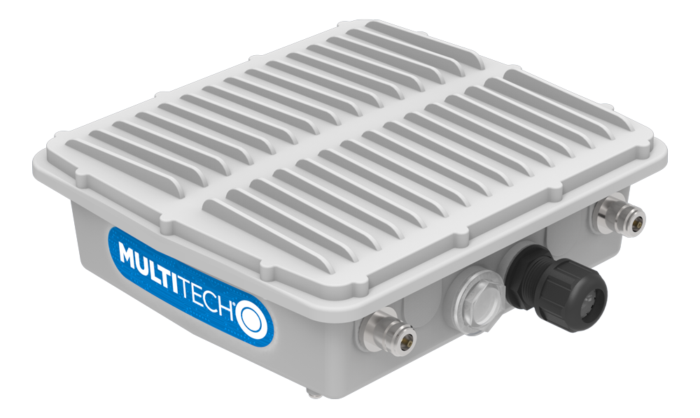

# Adaptive City Platform LoraWAN gateway setup

## Multitech

[Console access to setup the Conduit gateway (mLinux)](http://www.multitech.net/developer/software/mlinux/getting-started-with-conduit-mlinux/)
